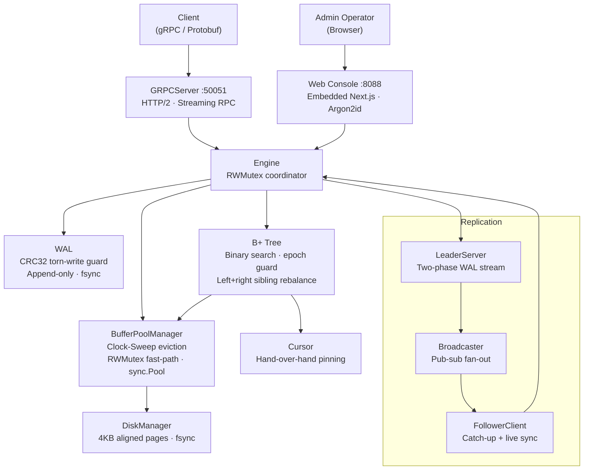

# ⚡ BeastDB

A high-performance, distributed, crash-resilient database engine built from scratch in **pure Go** — no frameworks, no ORMs, no shortcuts. Every byte of the storage engine, replication layer, index, and embedded web studio was implemented by hand, from first principles.

[](https://go.dev/)
[](docs/studio.md)
[](ROADMAP.md)
[](LICENSE)
[](CONTRIBUTING.md)
[](/)

---

## 🏛️ What's Inside

| Layer | What Was Built |
|---|---|
| **Memory** | Zero-copy string↔byte conversions, cache-line-padded structs, FNV-1a hasher, open-addressing hash map, binary heap, ring buffer |
| **Network** | Custom binary TCP frame protocol (10-byte header + CRC32), zero-allocation RESP2 parser & writer |
| **Cache** | 64-shard partitioned `RWMutex` map, O(1) LRU eviction list, dual passive+active TTL heap, `sync.Pool` buffer recycling |
| **Storage** | 4KB hardware-aligned Slotted Pages (stable `RID`s, O(1) tombstone delete), `fsync`-safe Disk Manager, Clock-Sweep Buffer Pool |
| **Durability** | 23-byte binary WAL frames with IEEE CRC32 torn-write detection, crash recovery scanner, checkpointing |
| **Indexing** | On-disk B+ Tree — binary search routing, 50/50 leaf splits, borrow/merge rebalancing, streaming cursor with epoch concurrency detection |
| **API** | Protobuf schema + gRPC service (unary + server-streaming), HTTP/2 multiplexing |
| **Replication** | Leader-Follower WAL streaming — two-phase catch-up replay + live pub-sub broadcaster, batched ACK coalescing |
| **Studio** | Embedded Next.js 15 Web Console (`//go:embed all:static`, 0 Node.js runtime), Argon2id auth, universal data explorer, 64-bit key bit-slicer |

---

## 🖥️ BeastDB Studio (Embedded Web Console)

BeastDB ships with **BeastDB Studio** — a modern, dark-mode administrative console embedded directly into the Go executable with **zero Node.js production runtime overhead**:

- **Universal Multi-Purpose Data Explorer**: Introspects and visualizes **any schema** with zero data loss — complex nested JSON documents, plain string indices, delimited tokens, and raw payloads.
- **Dual Layout Modes**: Switch between responsive **Card Gallery** (with media box art / cover detection) and dense **Data Table** (with column sorting and attribute pills).
- **Adaptive Field Inspector**: Deep property sheet rendering every single nested attribute, image preview, date, and boolean badge.
- **64-Bit Key Bit-Slicer**: Decomposes any uint64 key into Hex, Decimal, and Binary (High 8-bit Partition Prefix, 28-bit Bucket, 28-bit Item ID).
- **Streaming Range Pagination**: Non-blocking B+ Tree cursor scan with `nextKey` continuation.

> 📖 Deep-dive into architecture, auth synchronization, and key slicing: [docs/studio.md](docs/studio.md)

---

## 📊 Performance Benchmarks

Benchmarked on **Intel Core i5-12450HX**, **Go 1.26**, Windows/amd64 (`go test -bench=. -benchmem ./...`):

| Component | Benchmark | Latency | Throughput | Allocs |
|---|---|---|---|---|
| **Core DSA** | Vector Push | **1.37 ns/op** | ~729M ops/sec | **0 B · 0 allocs** |
| **Core DSA** | Ring Buffer Push/Pop | **1.73 ns/op** | ~578M ops/sec | **0 B · 0 allocs** |
| **Core DSA** | Open-Address Hash Get | **8.45 ns/op** | ~118M ops/sec | **0 B · 0 allocs** |
| **Core DSA** | Zero-Copy `[]byte→string` | **0.30 ns/op** | ~3.3B ops/sec | **0 B · 0 allocs** |
| **Storage** | Slotted Page Tuple Read | **8.01 ns/op** | ~125M reads/sec | **0 B · 0 allocs** |
| **Index** | B+ Tree Point Query | **180 ns/op** | ~5.5M lookups/sec | **0 B · 0 allocs** |
| **Index** | Streaming Cursor Scan (101 keys) | **1208 ns/op** | ~12 ns/key | **64 B · 1 alloc** |
| **Cache** | Sharded Concurrent Get | **51.1 ns/op** | ~19.5M ops/sec | **21 B · 1 alloc** |
| **Cache** | Set/Get Roundtrip | **92.8 ns/op** | ~10.7M ops/sec | **11 B · 1 alloc** |
| **Durability** | WAL Append + fsync | **2.35 µs/op** | ~425K writes/sec | **64 B · 1 alloc** |
| **Network** | TCP Frame Encode | **30.4 ns/op** | ~33M frames/sec | **48 B · 1 alloc** |
| **API** | gRPC End-to-End Get | **129 µs/op** | ~7.7K req/sec | 9KB · 152 allocs |

---

## 🏗️ Architecture



> 📐 Full component spec: [docs/architecture.md](docs/architecture.md)

---

## ⚖️ Workload Profile & Trade-offs (B+ Tree vs. LSM-Tree)

BeastDB is architected as a **Read-Optimized / Balanced OLTP Engine**, prioritizing deterministic sub-microsecond point reads and streaming range scans over pure write-ingestion append logs.

| Dimension | B+ Tree Engine (BeastDB) | LSM-Tree Engine (e.g., RocksDB) |
|---|---|---|
| **Primary Workload** | **Point reads, updates & ordered range scans** | Write-heavy ingestion & append-only streams |
| **Point Read Latency**| **$O(\log_B N)$ direct jump** (180 ns, 0 allocs) | Multi-level lookup (MemTable + Bloom + SSTables) |
| **Range Scans** | **Sequential leaf traversal** (12 ns/key) | Multi-way merge-sort across sorted runs |
| **Tail Latency** | **Predictable** (no compaction spikes) | Variable (subject to compaction write stalls) |
| **Role of WAL** | **Crash durability** (ARIES recovery for pages) | **Primary ingest buffer** (replays to MemTable) |

---

## 🛠️ Developer Setup & Quickstart

### Prerequisites
- **Go 1.26+** · **Git** · **Docker & Docker Compose** *(optional)*

### 1. Run Engine + Studio Locally
```bash
# Launch Primary Leader with gRPC (:50051) and Studio Web Console (:8088)
go run ./cmd/server \
  -role leader \
  -port 50051 \
  -data-dir ./tmp/primary \
  -web-addr 0.0.0.0:8088 \
  -admin-password changeme

# Open Studio Console: http://localhost:8088 (User: admin)
```

### 2. Multi-Node Replication Cluster (Docker Compose)
```bash
# Spins up 1 Leader (50051, Studio 8088) + 2 Followers (50052, 50053)
docker compose up -d --build
```

### 3. Tests & Micro-Benchmarks
```bash
# Run unit tests and chaos torn-write injection recovery
go test -v ./...

# Run zero-allocation benchmarks
go test -bench=. -benchmem ./...
```

### 4. Language-Agnostic Client Integration
BeastDB defines its contract with [Protocol Buffers](api/proto/beastdb.proto) for native zero-dependency clients in any language:

```go
// Go Client Example
conn, _ := grpc.NewClient("localhost:50051", grpc.WithTransportCredentials(insecure.NewCredentials()))
client := beastv1.NewBeastDBServiceClient(conn)
client.Put(ctx, &beastv1.PutRequest{Key: 42, Value: []byte("beast_mode")})
```

> 🌐 See [docs/clients.md](docs/clients.md) for Python, Node.js/TypeScript, and Rust guides.

---

## 👤 Author

Sheersh Jaiswal ([@ChromaBeast](https://github.com/ChromaBeast))
