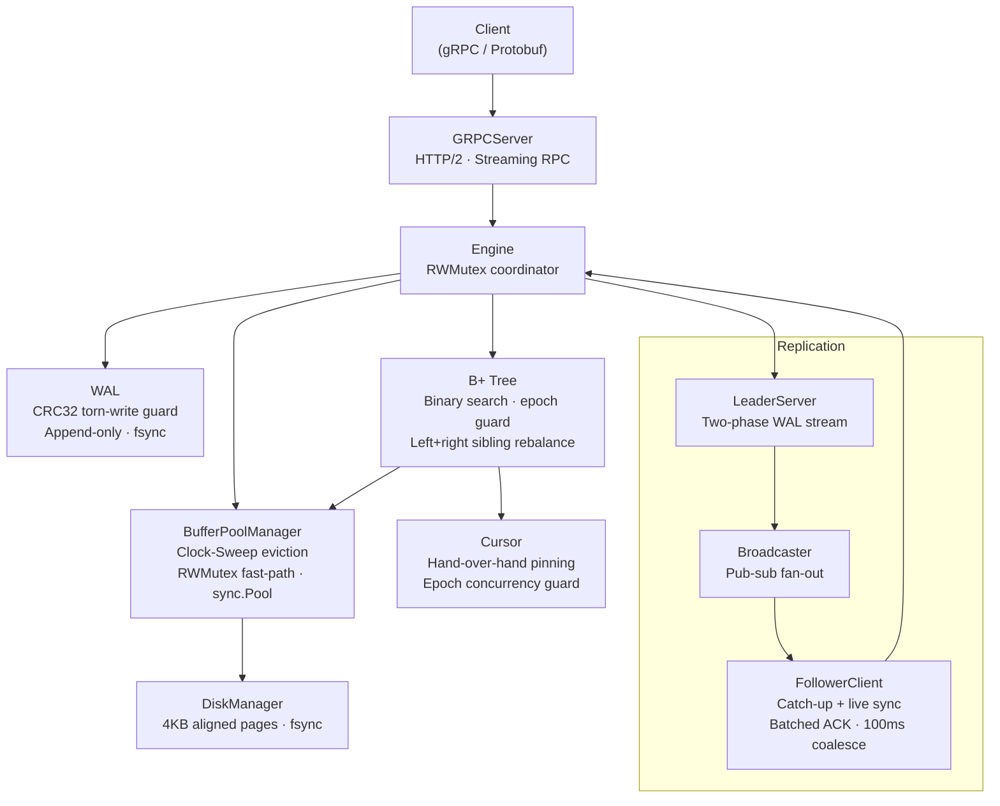

# ⚡ BeastDB

A high-performance, distributed, crash-resilient database engine built from scratch in **pure Go** — no frameworks, no ORMs, no shortcuts. Every byte of the storage engine, replication layer, and index was implemented by hand, from first principles.

[](https://go.dev/)
[](ROADMAP.md)
[](LICENSE)
[](CONTRIBUTING.md)
[](/)

---

## 🏛️ What's Inside

BeastDB is a 16-week systems engineering deep-dive, building every major database component layer by layer:

| Layer | What Was Built |
|---|---|
| **Memory** | Zero-copy string↔byte conversions, cache-line-padded structs, FNV-1a hasher, open-addressing hash map, generic binary heap, ring buffer |
| **Network** | Custom binary TCP frame protocol (10-byte header + CRC32), zero-allocation RESP2 parser & writer |
| **Cache** | 64-shard partitioned `RWMutex` map, O(1) LRU eviction list, dual passive+active TTL heap, `sync.Pool` buffer recycling |
| **Storage** | 4KB hardware-aligned Slotted Pages (stable `RID`s, O(1) tombstone delete, defrag), `fsync`-safe Disk Manager, Clock-Sweep Buffer Pool Manager with per-frame atomic pin counts |
| **Durability** | 23-byte binary WAL frames with IEEE CRC32 torn-write detection, crash recovery scanner, WAL rotation/checkpointing |
| **Indexing** | On-disk B+ Tree — binary search routing, 50/50 leaf splits, left+right sibling borrow/merge on underflow, streaming `Cursor` with hand-over-hand page pinning and epoch-based concurrent modification detection |
| **API** | Protobuf schema + gRPC service (unary + server-streaming), HTTP/2 multiplexing |
| **Replication** | Leader-Follower WAL streaming — two-phase catch-up replay + live pub-sub broadcaster, batched ACK coalescing, follower crash recovery |
| **Operations** | Multi-stage Docker build (CGO_ENABLED=0, static binary), 3-node Docker Compose cluster, graceful 10-second SIGTERM shutdown |

---

## 📊 Performance Benchmarks

Benchmarked on **Intel Core i5-12450HX**, **Go 1.26**, Windows/amd64 (`go test -bench=. -benchmem ./...`):

| Component | Benchmark | Latency | Throughput | Allocs |
|---|---|---|---|---|
| **Core DSA** | Vector Push | **1.37 ns/op** | ~729M ops/sec | **0 B · 0 allocs** |
| **Core DSA** | Ring Buffer Push/Pop | **1.73 ns/op** | ~578M ops/sec | **0 B · 0 allocs** |
| **Core DSA** | Open-Address Hash Get | **8.45 ns/op** | ~118M ops/sec | **0 B · 0 allocs** |
| **Core DSA** | Zero-Copy `[]byte→string` | **0.30 ns/op** | ~3.3B ops/sec | **0 B · 0 allocs** |
| **Storage** | Slotted Page Tuple Read | **8.01 ns/op** | ~125M reads/sec | **0 B · 0 allocs** |
| **Index** | B+ Tree Point Query | **180 ns/op** | ~5.5M lookups/sec | **0 B · 0 allocs** |
| **Index** | Streaming Cursor Scan (101 keys) | **1208 ns/op** | ~12 ns/key | **64 B · 1 alloc** |
| **Cache** | Sharded Concurrent Get | **51.1 ns/op** | ~19.5M ops/sec | **21 B · 1 alloc** |
| **Cache** | Set/Get Roundtrip | **92.8 ns/op** | ~10.7M ops/sec | **11 B · 1 alloc** |
| **Durability** | WAL Append + fsync | **2.35 µs/op** | ~425K writes/sec | **64 B · 1 alloc** |
| **Network** | TCP Frame Encode | **30.4 ns/op** | ~33M frames/sec | **48 B · 1 alloc** |
| **API** | gRPC End-to-End Get | **129 µs/op** | ~7.7K req/sec | 9KB · 152 allocs |

---

## 🏗️ Architecture



> 📐 Full component spec: [docs/architecture.md](docs/architecture.md)

---

## ⚖️ Workload Profile & Trade-offs (B+ Tree vs. LSM-Tree)

BeastDB is architected as a **Read-Optimized / Balanced OLTP Engine** (similar to SQLite, PostgreSQL, and MySQL/InnoDB), prioritizing deterministic sub-microsecond point reads and streaming range scans rather than pure write-ingestion append logs (like RocksDB or Cassandra).

| Architectural Dimension | B+ Tree Engine (BeastDB) | LSM-Tree Engine (e.g., RocksDB) |
| :--- | :--- | :--- |
| **Primary Workload** | **Point reads, updates & ordered range scans** | Write-heavy ingestion & append-only time series |
| **Point Read Latency** | **$O(\log_B N)$ direct jump** (180 ns, 0 allocs) | Multi-level lookup (MemTable + Bloom filters + SSTables) |
| **Range Scans** | **Sequential leaf traversal** via `NextPageID` (12 ns/key) | Multi-way merge-sort across sorted runs |
| **Write Amplification** | Higher (in-place page updates & leaf splits) | Lower on initial ingest (sequential MemTable appends) |
| **Tail Latency** | **Predictable** (no background compactions) | Variable (subject to compaction write stalls) |
| **Role of WAL** | **Crash durability** (ARIES recovery for in-place pages) | **Primary ingest buffer** (replays into MemTable) |

### Why B+ Tree over LSM-Tree for BeastDB?
1. **Zero Compaction Debt:** LSM-trees defer work to background compactions, causing I/O spikes and tail-latency variability. BeastDB maintains a balanced on-disk index with consistent latencies.
2. **Hardware Mechanical Sympathy:** Point queries traverse 4KB slotted pages and memory-pinned frames via the Buffer Pool Manager without scanning Bloom filters or merging duplicate keys across levels.

---

## 🗺️ 16-Week Roadmap

| Phase | Milestone | Focus Areas | Status |
|---|---|---|---|
| **Phase 1** | [Core DSA & Memory](docs/phase1_dsa.md) | Struct padding, Vector, Ring Buffer, Heap, FNV-1a Hash Map | ✅ |
| **Phase 2** | [Network & Cache](docs/phase2_net_cache.md) | TCP framing, RESP2 parser, Sharded locks, LRU+TTL Cache | ✅ |
| **Phase 3** | [Storage & Indexing](docs/phase3_storage.md) | WAL (CRC32), 4KB Slotted Pages, Disk Manager, B+ Tree + Cursor | ✅ |
| **Phase 4** | [Scaling & Production](docs/phase4_scaling.md) | gRPC/Protobuf, Leader-Follower Replication, Docker Cluster | ✅ |

---

## 🛠️ Developer Setup & Quickstart

### Prerequisites
- **Go 1.26+**
- **Git**
- **Docker & Docker Compose** *(optional, for containerized clusters)*

### 1. Clone & Dependencies
```bash
git clone https://github.com/ChromaBeast/BeastDB.git
cd BeastDB
go mod download
```

### 2. Run Engine Locally (Leader & Replicas)
```bash
# Launch Primary Leader (gRPC port 50051)
go run ./cmd/server -role leader -port 50051 -data-dir ./tmp/primary

# Launch Follower (streams live WAL replication from leader)
go run ./cmd/server -role follower -port 50052 -leader-addr localhost:50051 -replica-id replica-1 -data-dir ./tmp/replica1
```

### 3. Docker Compose 3-Node Cluster
```bash
# Spins up 1 Leader (50051) + 2 Followers (50052, 50053) with persistent volumes
docker compose up -d --build
```

### 4. Tests, Benchmarks & Validation
```bash
# Run unit & chaos test suite (torn-write injection, CRC32 WAL recovery)
go test -v ./...

# Run zero-allocation micro-benchmarks with memory profiling
go test -bench=. -benchmem ./...

# Automated interactive presentation demo (PowerShell)
.\demo.ps1
```

### 5. Multi-Language Client Integration (Language-Agnostic)
BeastDB defines its API contract with [Protocol Buffers](api/proto/beastdb.proto), enabling native clients in **any programming language** without Go runtime dependencies.

**Go:**
```go
conn, _ := grpc.NewClient("localhost:50051", grpc.WithTransportCredentials(insecure.NewCredentials()))
client := beastv1.NewBeastDBServiceClient(conn)
client.Put(ctx, &beastv1.PutRequest{Key: 42, Value: []byte("beast_mode")})
resp, _ := client.Get(ctx, &beastv1.GetRequest{Key: 42})
```

**Python:**
```python
channel = grpc.insecure_channel("localhost:50051")
client = beastdb_pb2_grpc.BeastDBServiceStub(channel)
client.Put(beastdb_pb2.PutRequest(key=42, value=b"beast_mode"))
resp = client.Get(beastdb_pb2.GetRequest(key=42))
```

> 🌐 See [docs/clients.md](docs/clients.md) for Python, Node.js/TypeScript, Rust guides & Protobuf code-gen.

---

## 👤 Author

**ChromaBeast** · [GitHub @ChromaBeast](https://github.com/ChromaBeast)
