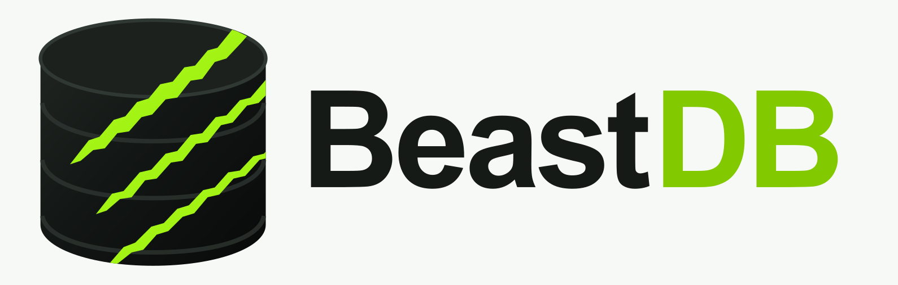
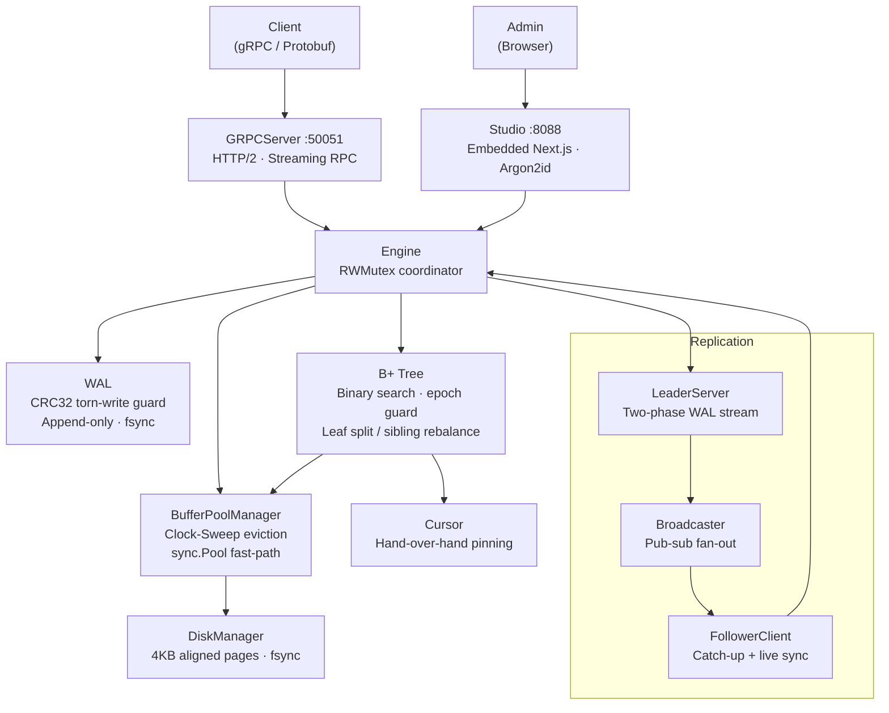

<p align="center">
  <picture>
    <source media="(prefers-color-scheme: dark)" srcset="docs/assets/beastdb-preview-dark.png" />
    
  </picture>
</p>

<h3 align="center">High-Performance, Crash-Resilient Distributed Database — Built from Scratch in Pure Go</h3>

<p align="center">
  <a href="https://go.dev/"></a>
  <a href="LICENSE"></a>
  <a href="ROADMAP.md"></a>
  
  
</p>

---

BeastDB is a purpose-built OLTP database engine designed for **read-heavy, structured workloads**. Every layer — from memory allocation to on-disk page layout — is implemented from first principles in Go with zero external dependencies beyond gRPC.

It ships as a **single static binary** that includes a full gRPC service, WAL-backed durability, leader-follower replication, and an embedded Next.js web console. No sidecars, no JVM, no Node.js runtime in production.

---

## Why BeastDB?

| Concern | How BeastDB addresses it |
|---|---|
| **Predictable latency** | B+ Tree with `O(log N)` point reads at 180 ns, 0 allocs — no compaction spikes |
| **Crash safety** | 23-byte ARIES WAL frames with CRC32 torn-write detection; full replay on boot |
| **Operational simplicity** | Single binary, `go run ./cmd/server -dev` for local dev, `docker compose up` for prod |
| **Developer ergonomics** | Embedded Studio web UI, `beastctl` CLI, partition-aware key builder, fixture seeding |
| **Replication** | Leader-follower WAL streaming — two-phase catch-up + live pub-sub, batched ACK coalescing |

---

## Quickstart

### Local dev (ephemeral, zero disk residue)
```bash
go run ./cmd/server -dev
```
Starts gRPC on `:50051`, opens Studio at `http://localhost:8088` (`admin / admin`), and purges all data on `Ctrl+C`.

### Production / persistent
```bash
go run ./cmd/server \
  -role leader \
  -port 50051 \
  -data-dir ./data \
  -web-addr 0.0.0.0:8088 \
  -admin-password your_password \
  -partition-config ./examples/partitions.example.json
```

### 3-node cluster (Docker)
```bash
# Leader (:50051, Studio :8088) + Follower-1 (:50052) + Follower-2 (:50053)
BEASTDB_ADMIN_PASSWORD=secret docker compose up -d --build
```

---

## `beastctl` CLI

Standalone binary for scripting, CI pipelines, and disaster recovery — no browser required.

```bash
go build -o beastctl ./cmd/beastctl

beastctl ping    --addr 127.0.0.1:50051                        # Health check + latency
beastctl backup  --db-dir ./data --out backup.tar.gz           # Atomic physical backup bundle
beastctl verify  --bundle backup.tar.gz                        # Validate SHA-256 manifest
beastctl restore --bundle backup.tar.gz --target-dir ./data    # Clean-host disaster recovery
beastctl export  --out export.json --partition 0x01            # Logical snapshot export
beastctl import  --file export.json                            # Bulk load records
beastctl seed    --file examples/fixtures/seed.json            # Load fixtures with partition stats
beastctl get     --key 72057594037927936                       # Point read by 64-bit key
beastctl put     --key 72057594037927936 --value '{"name":"x"}' # Write a record
```

---

## BeastDB Studio

An administrative console embedded directly in the binary — zero Node.js in production.

- **Firebase-Style 3-Pane Explorer** — Partition rail → Document list → Full field inspector
- **Partition-Aware Key Builder** — Auto-computes `(prefix << 56) | FNV28(domain) << 28) | FNV28(item)`.
- **64-Bit Key Bit-Slicer** — Decomposes any `uint64` key into prefix / domain / item segments with hex + binary view
- **Cascading User Deletion** — Atomic wipe across all partitions for a given user hash
- **Automatic Secret Redaction** — `passwordHash`, `salt`, `token`, `apiKey` stripped at parse time
- **Live Partition Donut Chart** — Ground-truth partition counts via key-only B+ Tree leaf scan (0 tuple I/O)

---

## Engine Architecture


```mermaid
flowchart TD
    Client["Client\n(gRPC / Protobuf)"] --> GS["GRPCServer :50051\nHTTP/2 · Streaming RPC"]
    Browser["Admin\n(Browser)"] --> WS["Studio :8088\nEmbedded Next.js · Argon2id"]

    GS --> E["Engine\nRWMutex coordinator"]
    WS --> E

    E --> WAL["WAL\nCRC32 torn-write guard\nAppend-only · fsync"]
    E --> BPM["BufferPoolManager\nClock-Sweep eviction\nsync.Pool fast-path"]
    E --> BT["B+ Tree\nBinary search · epoch guard\nLeaf split / sibling rebalance"]

    BPM --> DM["DiskManager\n4KB aligned pages · fsync"]
    BT --> BPM
    BT --> CUR["Cursor\nHand-over-hand pinning"]

    subgraph Replication
        L["LeaderServer\nTwo-phase WAL stream"] --> BC["Broadcaster\nPub-sub fan-out"]
        BC --> F["FollowerClient\nCatch-up + live sync"]
    end

    E --> L
    F --> E
```

---

## Benchmarks

Measured on **Intel Core i5-12450HX**, Go 1.26, Windows/amd64 (see [`docs/benchmarks.md`](docs/benchmarks.md)):

| Workload / Component | Operation | Latency / Throughput | Allocs |
|---|---|---|---|
| **System Workload** | 80% Read · 15% Write · 5% Scan | **17,789 ops/sec** (p95: 540 µs) | — |
| **Engine (With Cache)** | Point Read via B+ Tree + Slotted Page | **298 ns/op** | 48 B · 1 |
| **Engine (Without Cache)**| Cold Read (Forced Clock-Sweep Disk Eviction) | **543 ns/op** | 0 B · 0 |
| Storage | Slotted Page Tuple Read | **8.01 ns/op** | 0 B · 0 |
| Index | B+ Tree Point Query | **180 ns/op** | 0 B · 0 |
| Index | Streaming Cursor (101 keys) | **1208 ns/op** (~12 ns/key) | 64 B · 1 |
| Durability | WAL Append + fsync | **2.35 µs/op** | 64 B · 1 |
| Disaster Recovery | Clean-Host Restore & Replay (RTO) | **< 40 ms** | 0 lost writes (RPO=0) |
| API | gRPC End-to-End Get | **129 µs/op** | ~9 KB · 152 |

---

## B+ Tree vs LSM-Tree

BeastDB is optimized for **read-heavy OLTP** — deterministic point reads and ordered range scans.

| Dimension | BeastDB (B+ Tree) | RocksDB (LSM-Tree) |
|---|---|---|
| Point Read | `O(log N)` direct jump — **180 ns, 0 allocs** | MemTable + Bloom + multi-SSTable lookup |
| Range Scan | Sequential leaf traversal — **12 ns/key** | Multi-way merge-sort across sorted runs |
| Tail Latency | **Predictable** — no compaction spikes | Variable — subject to compaction write stalls |
| WAL Role | **Crash durability** (ARIES recovery for pages) | Primary ingest buffer (replays to MemTable) |

---

## Documentation

- [**V1 Semantics & Guarantees**](docs/v1-semantics.md) — Durability acknowledgment, limits, and replica reads.
- [**System Benchmarks**](docs/benchmarks.md) — Reproducible throughput, tail latencies, and cache-eviction profiles.
- [**Operator Guide**](docs/runbooks/operator-guide.md) — TLS configuration, cluster roles, manual failover, and `/healthz` probes.
- [**Disaster Recovery**](docs/runbooks/disaster-recovery.md) — Physical backup drills, checksum verification, and RTO/RPO SLA.
- [**Client Integration**](docs/clients.md) — Protobuf contracts for Go, Python, TypeScript, and Rust.

---

## 👤 Author

**Sheersh Jaiswal** · [@ChromaBeast](https://github.com/ChromaBeast)
